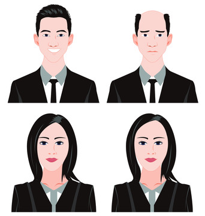

<h3>Team Name: Hairline Protection Association </h3>

<h3>Team Logo:</h3> 

<h3>Team Member:</h3>

- [Leshan Tan (Frank)](contributors/LeshanTAN.md)
- [Lin Chen (Lyn)](contributors/LinCHEN.md)
- [Ziyi Wang (Tina)](contributors/ZiyiWANG.md)
- [Zixiang Hu (Zack)](contributors/ZixiangHU.md)
- [Yicun Duan](contributors/YicunDUAN.md)
- [Yingxiao Huo](contributors/YingxiaoHUO.md)

### Analyses from Labs
- Our aim is to protect the hairline while getting more beautiful and making acheivements

### Lab projects
- [lab2 text analysis](lab02/docs/lab02textAna-V2.md)
- [lab3 sequence/activity diagram](lab03/docs/lab03Explanation.md)

### Version log for projects
- [version log for lab2](lab02/docs/version log for lab2.md)
- [version log for lab3](lab03/docs/versionLog.md)

### Exam projects
- [CW1](exam/docs/CW1.md)
- [version log for cw1](exam/docs/VLog.md)
- [CW2](cw2/docs/cw2.md)
- [version log for cw2](cw2/docs/versionLog.md)

