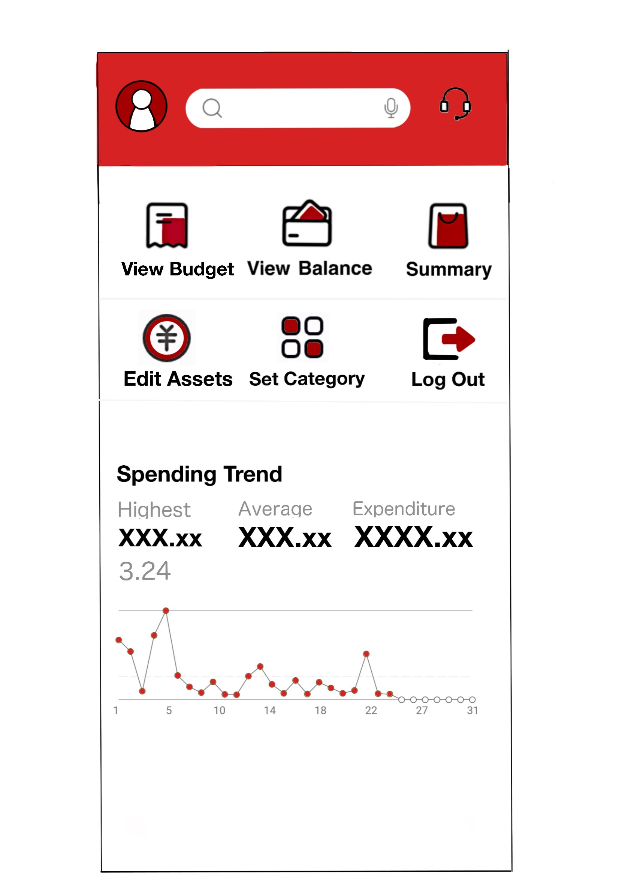
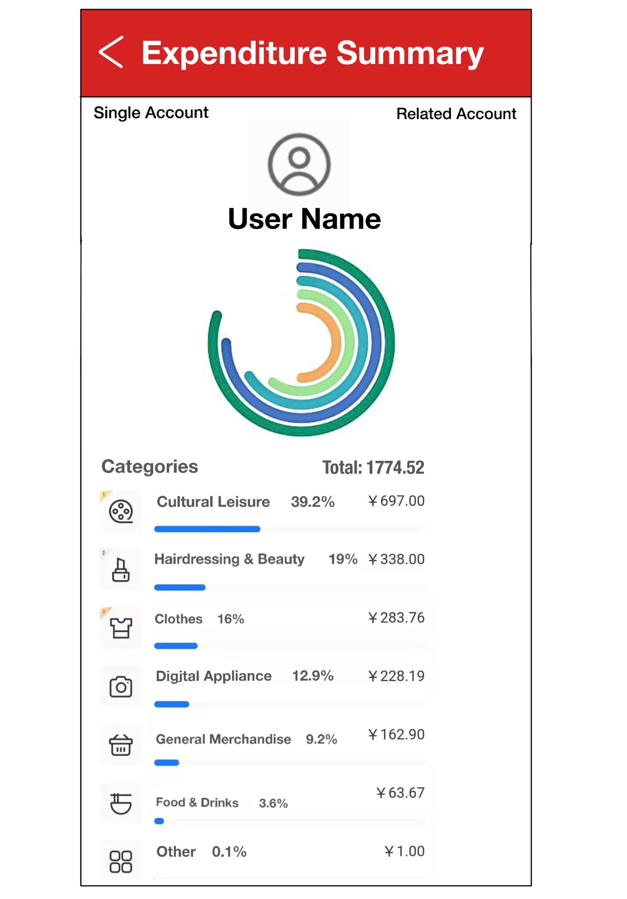
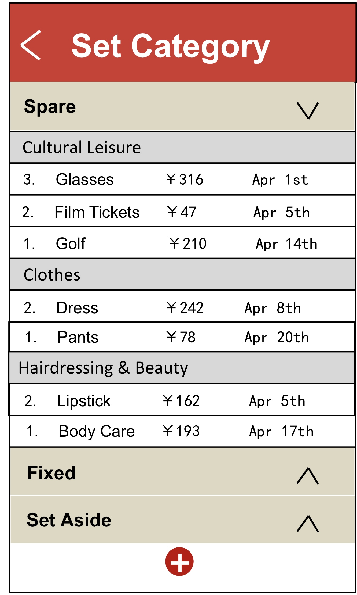

# ***Activity Diagram***

## **Overview**

**Why drawing activity diagrams**

1.According to users' requirements, this app is ought to contain various functions, such as viewing balance, viewing expenditure summary and editing asset. Different users will choose to use different functions when they interact with this app. These decisions made by users could be clearly displayed in activity diagram, which are represented by “Decision Node”.

2.Besides what is mentioned above, activity diagram could also show the events which happen concurrently. For instance, “fixed cost”, “average cost”, "set-aside" and "spare money" will be included in one page, and user will view these at the same time. Activity diagram is able to express this process by utilizing “Fork Node” and “Join Node”.

**Why choose all use cases?**
There are two main reasons for why we finally choose all use cases. The first reason is that after we finish drawing the first use case, we still have a lot of time. On account of this situation, we decide to draw more use cases. The second reason is that all use cases have mutual association, which makes it hard for us to just pick some parts of them. If we do so, the whole logic of the diagram will be ambiguous. In the end, we decide to choose all use cases.

**Why “show expenditure summaries”?**
Due to the fact that there are three kinds of customers (single-, multi-, joint- account users), we request this diagram to show the difference between them. After our discussion, we find that “show expenditure summaries” is the only function which will be performed in different ways when different types of users use it. Therefore, including “show expenditure summaries” in our diagram is of great importance.

**Why “set budget”?**
In this software, budget is needed because executors can take measures to make preparations, control deviation and ensure the realization of the planned target. And this software will let the users be careful if the budget is negative. So this function will let the user have a plan about their money/expenditure and they can manage their money better. This is a good representation of what the software can help people.

**Why “show category”?**
Showing category is easy for users to find detailed transactions. They can have a clear understanding of where and when each bill is paid and for what. Hence, it is easy for them to find abnormal economic conditions and know the usages for the money. It has a positive influence on the optimization and improvement of functions.

**Why “edit asset”?**
For system integrity reasons, we need this use case. In some cases, such as user might pay by cash or they will have unrecorded income and the bill will not be automatically added to this software. Therefore, the imported data may not truly reflect the user's bill, which may lead to a lack of system functionality. So “edit asset” is needed to make the software handling more complex problems in the society.

**Why “show balance”?**
As a normal operation of accounting software, it is necessary for users to know how much balance they have in their accounts. So they can know the amount of money available when facing emergency, know the current financial situation and clearly find the abnormal situation of economic activities.

**Diagram:**

In the following part, we will discuss the detailed flows and clarification.

In the detailed flows, we mainly discussed the workflow of the program.

In clarification, we state our solutions to the vague part of the requirements and our chioces for the conflicts over understanding.

&nbsp;

## **Detailed flows**

1. User log in, enter the number and password.
2. System search the account, if not matched, request user enter again.
3. System load the default types, account information, the record of expenditures and incomes from database.
4. System show the main page.
5. User select function.
	(1) Edit asset, users could add expenditure and input income by themselves (System will add some regular expenditure and income automatically).
	(2) Show expenditure summaries, depend on the type of user's account, system will show different summaries.
	(3) Set budget, the user could set amounts for different types. After setting the budget, the user could see these in a display page. However, user might not set budget, and, in this case, user will see a display page with no data.
	(4) Show category, if user want to change categories, user could edit these categories.
	(5) Show balance, user could view the balance of the account.
	(6) Log out.
6. After the previous steps are finished, the system will update the account information and back to the main page again. 

&nbsp;

### **Note:**
1. Because "variable cost" is not quantitative, we use "average cost" represents "variable cost".
2. At the stage of loading account information and default/set types, the system will load some expenditure and income from database of bank, and initialize the types if it is the first time use this program.
3. At the stage of showing summaries, different summaries are for different user, every users can view the "individual summary", "summary of all account" is for multi-account-user, "search the spender" is for joint-account-user.
4. There are four types of budget. In each type, many categories are set. For instance, the category "Clothes" belongs to "Spare" type (you can see this in our prototype). One expenditure of "Clothes" whose amount is "RMB242" will be automatically deducted from the "Spare" type.
5. At the stage of edit asset, user could add expenditure or income, the expenditure and income here is inputted by user manually, some expenditure and income which use the account straightly will be recorded by the system automatically.

## **Clarification**

**Question:** Should these functions have a sequence or they are concurrent?

**Answer:** They are concurrent, at the first version of our diagram, we gave these functions a sequence, but we think that users can select every function in the main page, even the functions need more data to operate.

**Question:** Why doesn't the diagram have "register account" action?

**Answer:** "We’ve been approached by a major bank, Bank of China (BoC), for an interesting new app for customers – it’s for personal finance management, using data directly from their accounts, but in a different app." From this sentence, we could find out that this app is not responsible for creating accounts, it just receives data from the database.

&nbsp;

# ***Scenario***

## **Overview**
**Why using Scenarios?**

1. According to the activity diagram, we can see that the workflows of different users may vary from each other. For example, single account user, multi-account user and joint account user will see different pages of summary. To describe this difference clearer and help us better understand it, scenario is used.
2. Unlike activity diagram, scenario often describes the workflow from the user side, which makes it more understandable and detailed. It is like an instruction manual in specific using context. For example, in scenario 1, we explain the categorize expenditure and reset the category functions of single account user with more concrete actions.

[**Click here to view our Scenario**](scenario.md)

### **Note:**
1. The Total amount on the summary page has different meaning for different users. For multi-account user, the Total means the sum of different accounts. For joint account user, the Total means the sum of different users' expenditure and income, with only one account. 
2. To explain all of the scenarios clearly and comprehensively, the first three scenarios are for single account user, the last two are for multi-account user and joint account user.
3. We think the APP is connected to the BoC account, if the user spends money using BoC credit card, the expenditure record will automatically be sent to the APP. Otherwise, users need to record the expenditure by themselves.
4. For safety considerations, users are advised to log out their accounts before closing the APP.

## **Clarification**
**Question:** What scenarios should be included?

**Answer:** It depends on the use cases and activity diagram. The scenarios should cover all of the aspects of different users' different actions. Therefore, to explain all of the actions clearly, we listed five scenarios. The first one describes the categorize expenditure and reset expenditure actions of single account user. The second one describes the recorded extra income, record expenditure and view account summary actions of single account user. The third one describes the set category for budget, view category and log out account actions of single account user. The fourth one describes the view all account summary and log out account actions of multi-account user. The last one describes the view account summary and view account spender actions of joint account user.

# ***Prototype***

| Stage            | Prototype Image                                              | Description                                                  |
| ---------------- | ------------------------------------------------------------ | ------------------------------------------------------------ |
| **Log In**       |     | This is the **interface** for the **login** **page**. Users can enter their account number and password and then **access main interface** by clicking on the **login button**. |
| **Main Page**    |  | Users can see the main interface immediately when they enter the app, **giving the shortcuts** to the things users do frequently.  ***It also has some simple information about spending trend.(See from Folding Line Chart below)*** |
| **View Budget**  | &nbsp;&nbsp; | Users can see the **amount of budget** they set as well as the amount of **four default categories**. They could also see the proportion and the number of remaining budgets and the expenditure as well. By clicking the **‘Edit’ button** on the top right, they can change their settings. They could also add a new category by clicking the **‘+’ button** at the bottom. |
| **View Balance** |  | Users can see their **total balance** in this page. By clicking the little eye behind the ‘total’, they can **hide the amount of their balance**. They can also see some items of recent expenditures. |
| **View Summary** |  | **multi-account user:**  Users can see the **expenditure/Income** of **each account** and the total amount of the selected month. Users can see the **proportion** of each account expenditure. Click the back in the navigate bar-> back to main page **Optional:** **see the details of the specific account** -> click the account name ->jump to the single account page.  **Joint-account user:**  Users can see the **expenditure/Income** of **each spender** and total amount of the selected month. Users can see the **proportion** of each spender’s expenditure. Click the back in the navigate bar-> back to main page. **Optional:** see the details of each spender expenditure -> click the spender name -> jump to single account page   **Single-account user:** Users can only see their own account. Users can see the **expenditure summary** on each category of the selected month Click the back in the navigate bar-> back to main page.  |
| **Edit Asset**   |  | Users can see the **current income and expenditure** on this page.  Click back in the navigate bar->back to the main page  **Optional:**  click “Edit” -> jump to the detailed page -> choose the edit type (income/expenditure)-> input corresponding amount->choose the category: (fixed/spare/average/set aside) -> choose the subtype (cultural leisure/clothes/beauty/…) -> input the remark ->click “save” ->change in the total asset page |
| **Set category** |  | On this Set Category page, users can see the **expenditure records with different categories**. **"Spare", "Fixed", "Set Aside" and "Variable"** are main categories and there are several sub categories under them. Users can see or **hide** the expenditure records by clicking the "expand/collapse" icons on the right. Click back in the navigate bar->back to the main page.  **Optional:** Click "Add" icons -> jump to the detailed page -> choose several expenditure records -> select or input their category -> click "save" -> change in the Summary page. |

