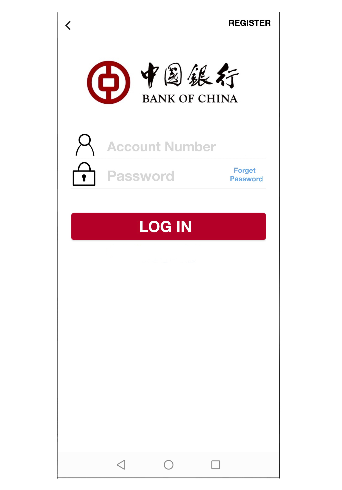
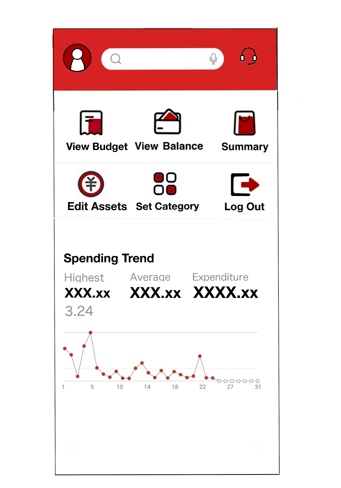
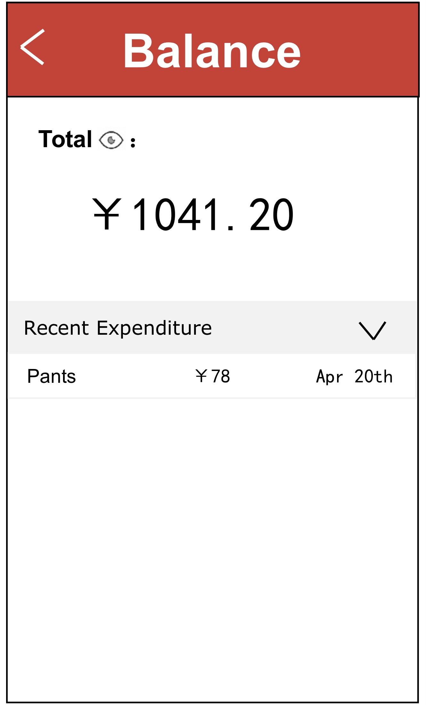
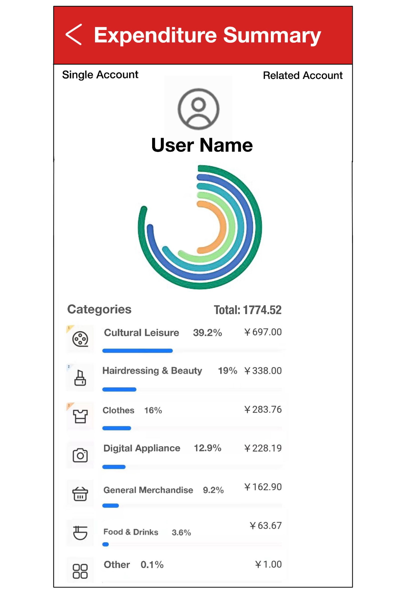
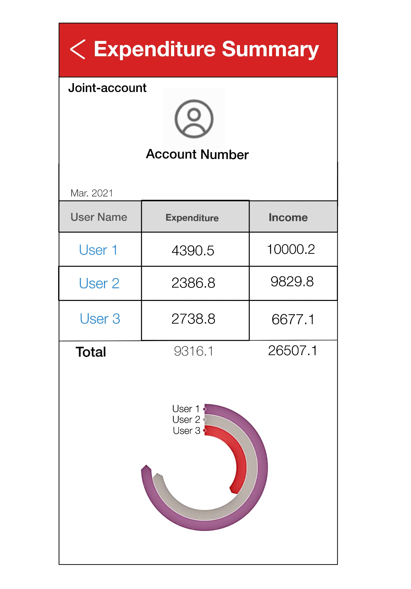
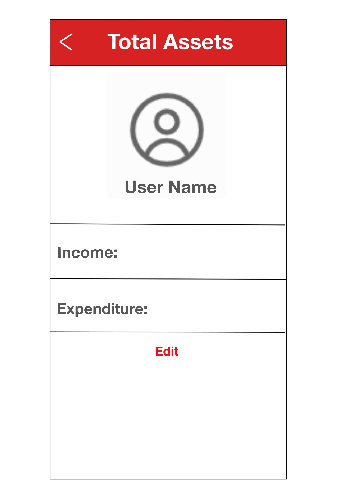
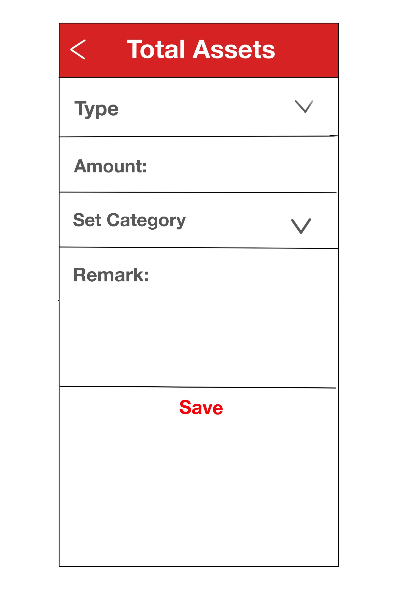
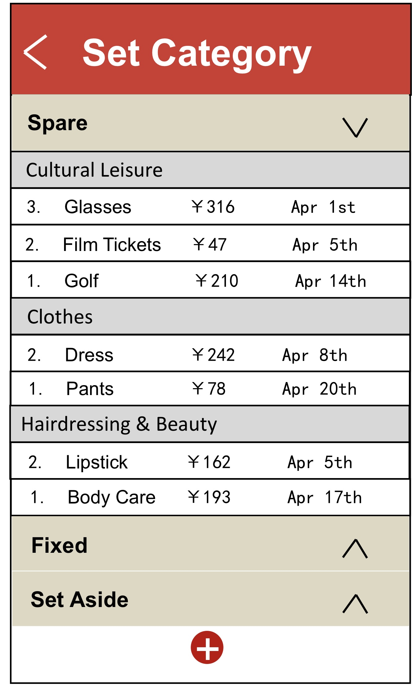

| Stage            | Prototype Image                                              | Description                                                  |
| ---------------- | ------------------------------------------------------------ | ------------------------------------------------------------ |
| **Log In**       |  | This is the **interface** for the **login** **page**. Users can enter their account number and password and then **access main interface** by clicking on the **login button**. |
| **Main Page**    |  | Users can see the main interface immediately when they enter the app, **giving the shortcuts** to the things users do frequently.  ***It also has some simple information about spending trend.(See from Folding Line Chart below)*** |
| **View Budget**  | &nbsp;&nbsp; | Users can see the **amount of budget** they set as well as the amount of **four default categories**. They could also see the proportion and the number of remaining budgets and the expenditure as well. By clicking the **‘Edit’ button** on the top right, they can change their settings. They could also add a new category by clicking the **‘+’ button** at the bottom. |
| **View Balance** |  | Users can see their **total balance** in this page. By clicking the little eye behind the ‘total’, they can **hide the amount of their balance**. They can also see some items of recent expenditures. |
| **View Summary** |  | **multi-account user:**  Users can see the **expenditure/Income** of **each account** and the total amount of the selected month. Users can see the **proportion** of each account expenditure. Click the back in the navigate bar-> back to main page **Optional:** **see the details of the specific account** -> click the account name ->jump to the single account page.  **Joint-account user:**  Users can see the **expenditure/Income** of **each spender** and total amount of the selected month. Users can see the **proportion** of each spender’s expenditure. Click the back in the navigate bar-> back to main page. **Optional:** see the details of each spender expenditure -> click the spender name -> jump to single account page   **Single-account user:** Users can only see their own account. Users can see the **expenditure summary** on each category of the selected month Click the back in the navigate bar-> back to main page.  |
| **Edit Asset**   |  | Users can see the **current income and expenditure** on this page.  Click back in the navigate bar->back to the main page  **Optional:**  click “Edit” -> jump to the detailed page -> choose the edit type (income/expenditure)-> input corresponding amount->choose the category: (fixed/spare/average/set aside) -> choose the subtype (cultural leisure/clothes/beauty/…) -> input the remark ->click “save” ->change in the total asset page |
| **Set category** |  | On this Set Category page, users can see the **expenditure records with different categories**. **"Spare", "Fixed", "Set Aside" and "Variable"** are main categories and there are several sub categories under them. Users can see or **hide** the expenditure records by clicking the "expand/collapse" icons on the right. Click back in the navigate bar->back to the main page.  **Optional:** Click "Add" icons -> jump to the detailed page -> choose several expenditure records -> select or input their category -> click "save" -> change in the Summary page. |
