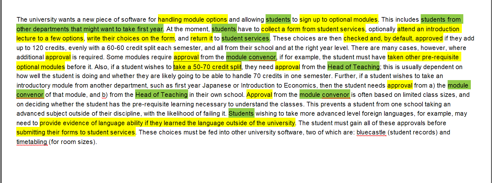

## The Explanation for Lab02's Diagram

The following is our **Explanation**.

- The system function is mainly to handle signing up to optional modules, includes collecting forms, filling in the forms and submitting the forms. Optionally, students can attend an introduction lecture to a few options.

- Students are divided into two groups which are **normal students** and **cross-department student**, as they have different use cases.

  

  

#### Two other diagram

Text analysis

Actors and use case

