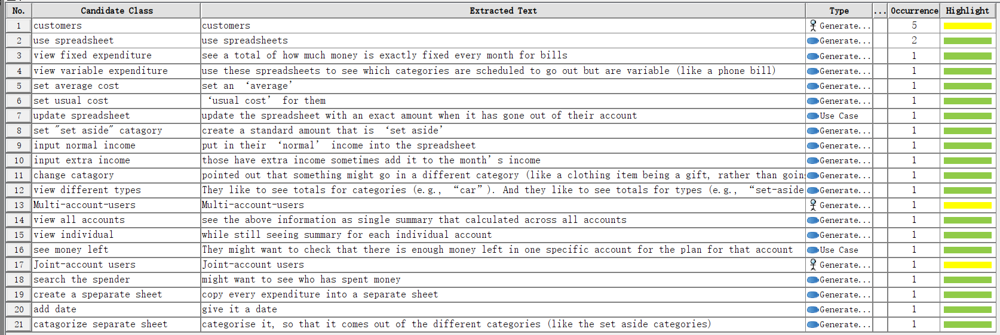
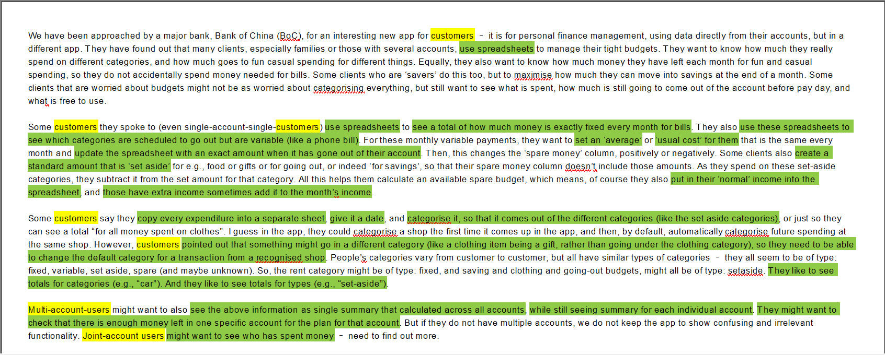
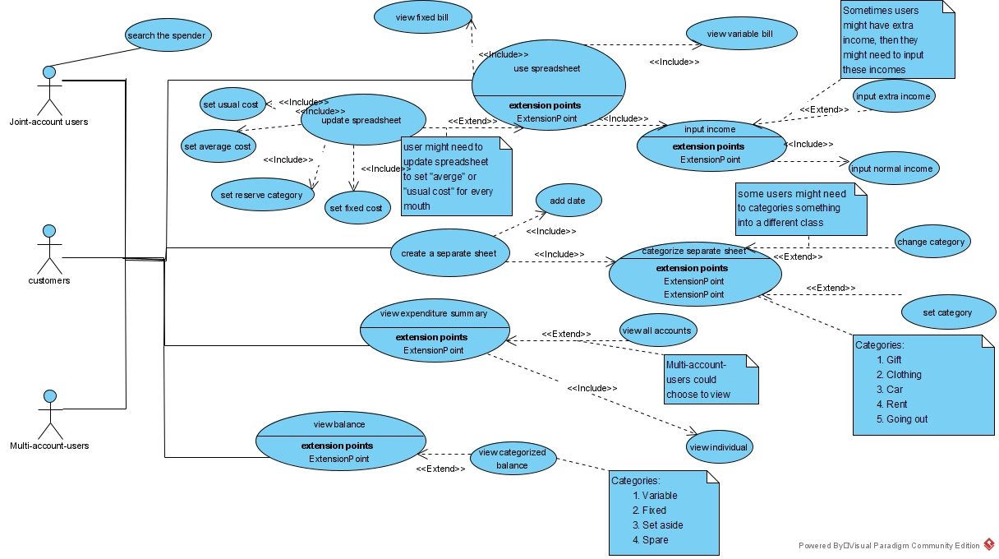

# The Explanation for Lab's Diagram


## Overall
**Why usecase diagram**
This application are designed to make it easier for customers to manage their budgets. The functionality is designed to categorize monthly payments using a spreadsheet so that budgets for different wishes can be managed perfectly. Whether it is to manage spare cash or to check the monthly fixed demand bill, this application would offer great help. Customizing product categories in-store in order to meet the needs of different customers.

&nbsp;

 Our explanation has been divided into **five** parts: **Stakeholder Analysis**, **Text Analysis**, **Use Case Analysis**, **Persona** and **Clarification**.

 The **Stakeholder Analysis** is the explanation for why we choose them as stakeholders and why they are primary/secondary/tertiary stakeholders.

The **Text Analysis** contains how we identify the actors and their corresponding use case. 

 The **Use Case Analysis** is specific use cases we summarized from the article, some of which may need some modifications to be more system-like.

The **Persona** aims to figure out the background information / of the our project's main user.

The **Clarification** is our understanding for some requirements that are indistinct in meaning or indirectly stated.


## Part 1: Text Analysis






&nbsp;
## Part 2: Stakeholder Analysis
 ```
Stackholder
 	Stakeholder is a person, an organization, or an external system that plays a role in one or more interactions with your system.
 
Primary stakeholder
	A primary stakeholder can be direct users, to be more specific, a beneficiary or a target Beneficiaries refer to individuals who stand to gain something directly and personally. 
 
Secondary stakeholder
	Secondary stakeholders are people who would be indirectly affected by projects, either positive or negative.
	
Tertiary stakeholder
	This category includes people and groups who pay for the system so that they may have an influence on this system.
 ```
&nbsp;

***In this use case diagram, there are three stakeholders:***

- **General customer:** one person that has one account at the bank.
- **Multi-account users:** they are persons who owned multiple accounts.
- **Joint-account users:** multiple and different persons use the same account.

**Primary Stakeholders:**

### In this use case diagram, there are three stakeholders:


### ***Primary Stakeholders:***
- **General customers:** They will do simple operations on the account, like cost classification, look the monthly surplus...
- **Multi-account users:** They have all the privileges that all general users have but they can also see summary for each 
individual account
- **Joint-account users:** They have all the privileges that all general users have but they can also see who use these  account to pay
&nbsp;
### ***Secondary Stakeholders:***
- **Police:**  Although they don't directly use this, but if there are criminal investigation needs or investigation of illegal funds, it will be used.

Although it is not directly use the system by mentioned actions
&nbsp;

### ***Tertiary Stakeholders:***

 Since it is a free downloaded software, except Bank of China,the government, there will be a small chance that other one will pay them.

 &nbsp;


## Part 3: Use Case Analysis

- **Use spreadsheet**
  
  ```
   Some customers they spoke to (even single-account-single-customers) use spreadsheets to see a total of how much money is exactly fixed every  month for bills. 
  ```
  - **View fixed bills**
    ```
    see a total of how much money is exactly fixed every month for bills
    ```
  - **View variable bills**
    ```
    They also use these spreadsheets to see which categories are scheduled to go out but are variable
    ```
- **Update spreadsheet ( optionally )**
  
    &nbsp;
    This optinoal actions include: Set average cost,Set usual cost,Set fixed cost,Set reserve money,Set reserve money.
    - **Set average cost**
      ```
      they want to set an ‘average’ or ‘usual cost’ for them that is the same every month 
      ```
    - **Set usual cost**
      ```
      they want to set an ‘average’ or ‘usual cost’ for them that is the same every month 
      ```
    - **Set fixed cost**
      ```
      update the spreadsheet with an exact amount when 
      it has gone out of their account.Then, this changes the 'spare money' column, positively or 
      negatively. 
      ```
    - **Set reserve money**
      ```
      Some clients also create a standard amount that is 'set aside' for e.g., food or gifts or for going out, or indeed ‘for savings’, so that their spare money column doesn’t include those amounts
      ```
    
    - **Input income**
  ```
  of course they also put in their ‘normal’ income into the spreadsheet, and those have extra income sometimes add it to the month’s income.
  ```
    - **Input normal income**
      ```
      put in their ‘normal’ income into the spreadsheet
      ```
    - **Input extra income ( optionally )**
      ```
      those have extra income sometimes add it to the month’s income.
      ```
    ```
  
    ```
  
- **Create seperate sheet**
  
  - **Add date**
    ```
    give it a date
    ```
  - **Categorize seperate sheet**
    ```
    And categorise it, so that it comes out of the different categories 
    ```
    - **Set category ( optionally )**
      ```
       categorise a shop the first time it comes up in the app, and then, by default, automatically categorise future spending at the same shop.
      ```
    - **Change category (optionally)**
      ```
      However, customers pointed out that something might go in a different category (like a clothing item being a gift, rather than going under the clothing category), so they need to be able to change the default category for a transaction from a recognised shop.
      ```
- **Search the spender**
  ```
  Joint-account users might want to see who has spent money – need to find out more.
  ```
- **View expenditure summary**
  - **View individual account**

  - **View all accounts(Optionally)**
    ```
    Multi-account-users might want to also see the above information as single summary that calculated across all accounts, while still seeing summary for each individual account.
    ```

- **View balance**
  ```
   view money left
  ```
    - **View categorized balance ( optionally )**
      ```
      They like to see totals for categories (e.g., “car”). And they like to see totals for types (e.g., “set-aside”).
      ```

**Note:**
- Use case "View all accounts" is optional beacuse according to the article, all of the users can view individual summary while multi-account-users can also view general summary of all accounts.
- Since not every user has an extra income, the "add extra income" use case should be "extend" while the "input normal income" use case should be "include".
- After create a seperate sheet, it is optional to set or change its category.
- We use "set reserve category" to replace "set-aside", which makes it to be more system like.
- We use "view categorized balance" to replace "view different types", which makes it to be more system like.
- "update spreadsheet" is optional because only when the exact amount has gone out will the spreadsheet be updated.


&nbsp;

## Part 4: Persona

- Persona for [normal user](../persona/normalUser.md)
- Persona for [multi-account user](../persona/multiUser.md)
- persona for [joint-account user](../persona/jointUser.md)

**Reasons**

As we are designing an app for different kinds of users for Bank of China, we get to have a clearer view of who are going to use this app, why they get to use it (the pain point for the user) and what they expect from it. And as is known to all, for users with different backgrounds and financial habits, the requirements for this app differs a lot. Also A clearer view of our persona might help our team members to draw their UML diagram. From text analysis we divided the main users into three categories according to the accounts they hold, one is normal users, one is joint-account users, the other is multi-account users. For example, 37 years old Paul Ford may pay more attention of his family’s diet, which means checking the fixed expenditure in particular area without other categories (see how much money is fixed every month for food).


## Part 5: Clarification

&nbsp;

***Question:***
which of the users should have the view summary use case?


***Solution:*** 
According to the sentence "Multi-account-users might want to also see the above information as single summary that calculated across all accounts, while still seeing summary for each individual account.", we can infer that all of the users can view individual summary while multi-account-users can also view general summary of all accounts.

&nbsp;

***Question:***
What is the relationship between the put in normal income and the add extra income use cases?

***Solution:*** 
We think these two use cases are parallel and they can be unified into an input income use case. Since not every user has an extra income, the "add extra income" use case should be "extend" while the "input normal income" use case should be "include".

&nbsp;

