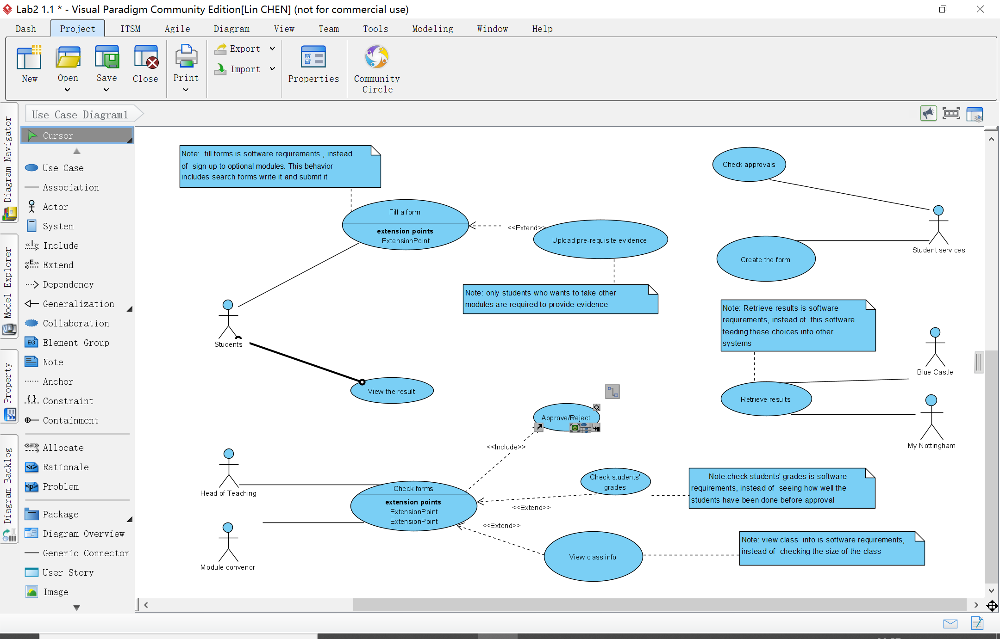

# **The Explanation for Lab's Diagram**


## **Overall**
---
 &nbsp;

 Our explanation has been divided into three parts: Stakeholder Analysis, Use Case Analysis and Clarification.

 The Stakeholder Analysis is the explanation for why we choose them as stakeholders and why they are primary/secondary/tertiary stakeholders.

 The Use Case Analysis is specific use cases we summarized from the article, some of which may need some modifications to be more system like.

 The Clarification is our understanding for some requirements that are indistinct in meaning or indirectly stated.


&nbsp;
## **Stakeholder Analysis**
---
&nbsp;
 ```
**Stackholder**
  Stakeholder is a person, an organization, or an external system that plays a role in one or more interactions with your system.
 
**Primary stakeholder**
  A primary stakeholder can be direct users, to be more specific, a beneficiary or a target Beneficiaries refer to individuals who stand to gain something directly and personally. 
 
**Secondary stakeholder**
  Secondary stakeholders are people who would be indirectly affected by projects, either positive or negative.
	
**Tertiary stakeholder**
  This category includes people and groups who pay for the system so that they may have an influence on this system.
 ```
&nbsp;

### In this use case diagram, there are  ? stakeholders:


&nbsp;

### ***Primary Stakeholders:***
- Students: On this system, they can fill the form and view their results
- Head of Teaching: On this system, they can check forms
- Module Convenor: On this system,module convenors can check forms
- Student Service: On this system, it can create forms and 
- Timetabling: will retrieve data transmitted by this system
- Blue Castle: will retrieve data transmitted by this system

 The above-listed individuals/departments will directly use the system by mentioned actions

&nbsp;

### ***Secondary Stakeholders:***
-  IT Service: it will help fix bugs and do the maintainance for this system

 Although it is not directly listed in the article, but we can still infer this infomation

&nbsp;

### ***Tertiary Stakeholders:***
- School: it will pay for the copyright of this system and purchase the right for using this system

Although it is not directly listed in the article, but we can still infer this infomation

&nbsp;
## **Use Case Analysis**
---
- **Fill a form :** 
    ```
    Allow students to sign up to optional modules.students have to collect a form from student services, optionally attend an introduction lecture to a few options, write their choices on the form, and return it to student services.
    ```
    * **Search a form**  -- collect a form from student services
    * **Write a form** -- write their choices on the form 
    * **Submit a form** -- return it to the Student Service
    * **Select credit split** -- a student wishes to take a 50-70 credit split
    * **Upload pre-requisite evidence (Optional)** -- whether the student has the pre-requisite learning necessary to understand the classes

- **View results**
- **Check forms:**
    * **Approve/ Reject**
    ```
    Some modules require approval from the module convenor
    ```
    * **Check students' grades (Optional)**
    ```
    This is usually dependent on how well the student is doing and whether they are likely going to be able to handle 70 credits in one semester.
    ```
    * **View class information (Optional)**
    ```
    Approval from the module convenor is often based on limited class sizes
    ```
- **Check approvals**
```
The student must gain all of these approvals before submitting their forms to student services. 
```
- **Create the form**
```
Students have to collect a form from student services
```
- **Retrieve results**
```
These choices must be fed into other university software, two of which are: bluecastle (student records) and timetabling (for room sizes).
```

### **Note:**
-  Searching a form is a use case that is more system like  than collecting a form
- Checking students' grades is a use case that is more system like than seeing how well the students have been done. And this can be checked by Head of Teaching
- Viewing class information is a use case that is more system like than checking the size of the class. And this can be done by the module convener
- Only students who wants to take other modules are required to provide evidence
- Retrieving results is a use case that is more system like than feeding these choices into other systems
- Viewing results is not mentioned in the article, but it is required based on the common sense
- Creating the form is implicitly mentioned since it is said that students get the form from the student service


&nbsp;
## **Clarification**
---
&nbsp;
### ***Question:*** *Are other systems which can use the data transmitted from this system stakeholders?*
### ***Solution:*** *Yes. By the definition, stakeholders can be an external system as long as they have interactions with this system.*

&nbsp;
### ***Question:*** Why we don't divide students into normal students and cross-department students
### ***Solution:*** Cause it is project oriented and it may be confused

