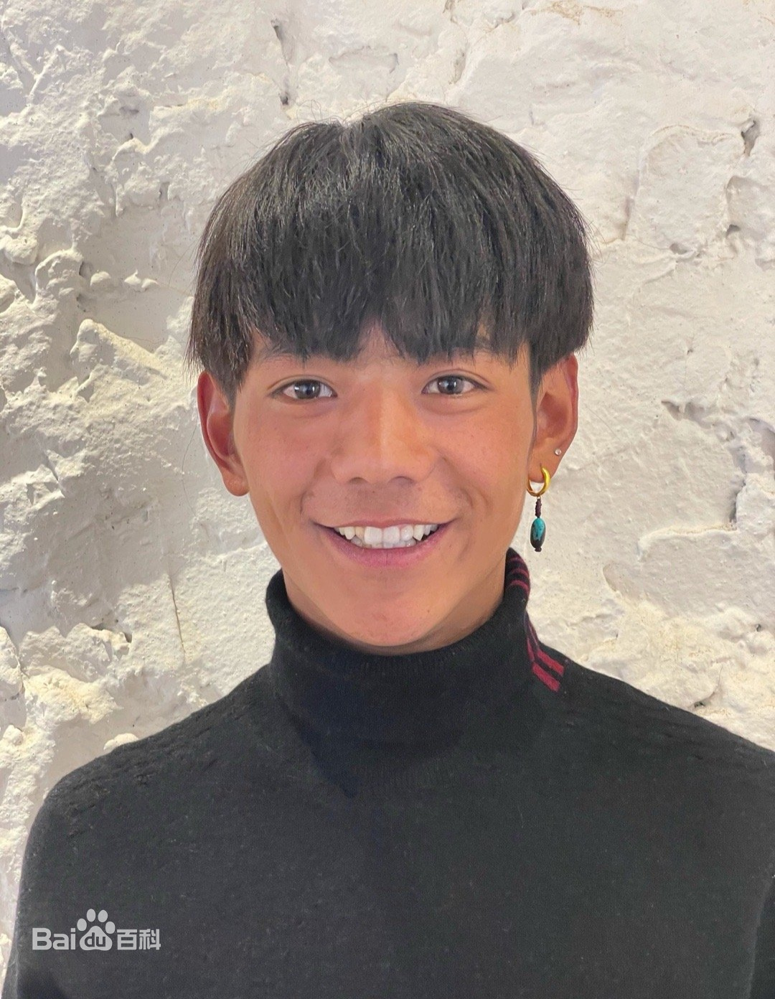

## Students' Persona
---

The *portrait* of the student:

**Personal information**
* Name: Zhen Ding
* Nationality: Zang
* Age: 20
* Gender: Male 

**Experience**
* Due to government's support, he became a famous celebrity. However, he nearly doesn't have any talent and skills. Therefore, many people doubt his success.
* Sadly, he doesn't realize his weakness.
* Any mistake of him is thought to be ignorable, just because he is too pure.

**Hobbies**
* Smoking
* Show his life in Tiktok

**_The whole system should be easy to use_**

The system is ought to be designed for **pure people** who are similar to me. The instruction of the application process should be easy to understand and it could reduce the utilization of professional vocabulary. Besides, you had better make a diagram of the procedure, which will be very helpful.
