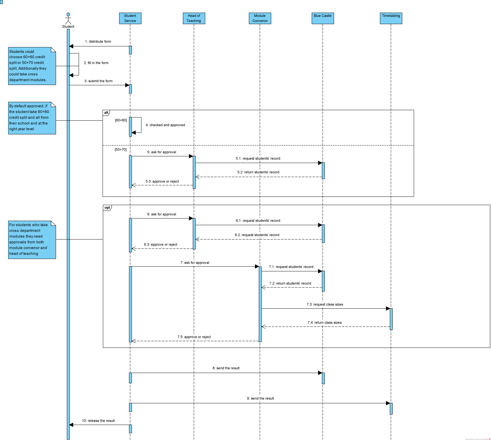

* [<strong>Lab03 Diagram Explanation</strong>](#lab03-diagram-explanation)
* [<em><strong>Activity Diagram</strong></em>](#activity-diagram)
  * [<strong>Overview</strong>](#overview)
  * [<strong>Detailed flows</strong>](#detailed-flows)
    * [<strong>Actors/Actions:</strong>](#actorsactions)
    * [<strong>Steps:</strong>](#steps)
    * [<strong>Note:</strong>](#note)
  * [<strong>Clarification</strong>](#clarification)
* [<em><strong>Sequence Diagram</strong></em>](#sequence-diagram)
  * [<strong>Overview</strong>](#overview-1)
  * [<strong>Detailed Interaction</strong>](#detailed-interaction)
    * [<strong>Note</strong>](#note-1)
  * [<strong>Clarification</strong>](#clarification-1)

# **Lab03 Diagram Explanation**

# ***Activity Diagram***

## **Overview**

**Why drawing diagrams**

Even though we have completed the text analysis diagram, and found out different stakeholders and detailed use cases, we still **don’t know the internal relationship of these use cases**. We desire a diagram which could clearly **display the whole workflow for the entire system**. In addition, the ideal diagram had better enable us to include some **decision points** and **parallel activities** in it, in account of the fact that a student’s application might be considered by both module convenor and head of teaching at the same time.

 **Why activity diagrams**

To achieve this goal, we analyze many diagrams. In the end, we discover that the activity diagram can fully satisfy our need. First, the **chronological order** of all use cases is easy to be expressed by using activity diagram. Besides, activity diagram is able to show the condition under which one use case will happen, which is greatly helpful to construct the workflow **containing many decision points**. What’s more, some events **happening concurrently** could also be displayed in this diagram by utilizing “bar”. Due to these advantages mentioned above, we finally decide to use activity diagram.

**Here is our diagram:**

In the following part, we will discuss the Detailed Flows and Clarification. 

In the Detailed Flows, we mainly discussed the actors and their corresponding actions. Also, we talked about the general flows of the program as well as how the decision is made in the note part.

In the Clarification, we state our solutions to the vague part of the requirements and our choices for the conflicts over understandings.

&nbsp;

## **Detailed flows**

### **Actors/Actions:**

- **Student service:**
  - create the form
  - check credit split 
  - send notification
  - check approvals
  - release results
- **Student:**
  - search the form
  - fill the form
  - upload evidence(optionally)
  - submit the form
  - view results
- **Module Convenor:**
  - view evidence
  - view class size
  - submit decisions
- **Head of Teaching:**
  - view evidence
  - view grades
  - submit decisions

&nbsp;

### **Steps:**

  1. Student service creates a form and releases it for student.  
  2. Students search for a form, fill the form, in this step, and then submit it. Students can optionally upload some evidence if required. 
  3. After student submit the form, the student service will check the form automatically and decide whether to notify the module convenor/the Head of Teaching
  4. For forms that doesn't need approval from the module convenor or head of teaching, the student service will automatically check the credit and make an approval.
  5. After receiving notification from the student service, the module convenor and Head of Teaching will check these forms, give their decisions based on their authority and send the results back to the student service. These actions will be done parallelly.
  6. After receiving results from the module convenor/ the Head of Teaching, the student service check the approvals, make the final decision and release the results
  7. The students can view these results

&nbsp;

### **Note:**

- Only students who want to take credit split,  take introductory module from another department or take pre-requisite module are required to provide the evidence. Others don't need to submit the evidence.

- After receiving forms, student service will first check students' choices. If some forms need to be approved, the head of teaching and module convenor will be notified to check these forms. For other forms, they will be automatically approved.

- Module convenor will deal with forms that express the intention to take introductory module from another department or take credit split. By checking the class size and ensuring its feasibility, the module convenor will make a decision -- only the class size is availble and the evidence is sufficient will the form be approved.

- Head of Teaching will deal with forms which express students' demands for taking other pre-requisite module or taking credit split. By checking the students' grades, the Head of Teaching will give a result -- only those who have good performance at school will be approved.

- The student service will check approvals from both Head of Teaching and module convenor. If one of them does not approve, the result will be failed.

&nbsp;

## **Clarification**

&nbsp;

#### ***Question:*** *Should the rejections from module convenor and head of teaching be performed in the diagram?*

#### ***Answer:*** *Yes, since activity diagram is used to explain the decision points and tell the clients what the results would be like in different conditions, we hold the viewpoint that these rejections should be performed in the diagram.*

&nbsp;

#### ***Question:*** *In this diagram, does student service need to send forms which require approval to either the head of teaching or module convenor? Or just let both the head of teaching and module convenor view all these forms and then make a decision?*

#### ***Answer:*** *Because this is a completed system, we think that there is no need to 'send'. Nevertheless, it is impossible for module convenors and the head of teaching to view all these forms. Therefore, we decide to make this action be 'send the notification', which means inviting these teachers to view these particular forms.

# ***Sequence Diagram***

## **Overview**

 **Why sequence diagrams**

We already drew the use case diagram in previous lab, however we want to have a more clear view of how objects in the system interact with each other and in the order of time. We considered context diagram, however it just shows the relation between system. We also had a look at the class diagram, it show static structure of classifiers in a system. Finally, we choose sequence diagram rather than other diagram, as it is a diagram showing the interaction between objects, and also these objects are arranged in chronological order. That's amazing, it entirely satisfied our demand!

**Here is our diagram:**

In the following part, we will discuss the Detailed Interaction and Clarification. 

In the Detailed Interaction we mainly discussed how the actors or objects interacts with each other, and their corresponding actions. 

In the Clarification, we state our solutions to the vague part of the requirements and our choices for the conflicts over understandings.

&nbsp;

## **Detailed Interaction**

- Student Service --> Student --- **distribute a form** 

- Student --> Student --- **fill in the form** 
  - Students take 60 + 60 credit split
  - Students take 50 + 70 credit split
  - **optional:** Students take cross department modules
- Student --> Student Service --- **submit the form**
- Student Service check forms
  - Students take *60 + 60* credit split (automatically approved)
  - Students take *50 + 70* credit split
    - Student Service --> Head of Teaching --- **ask for approval**
    - Head of Teaching --> Blue Castle --- **ask for students' record**
    - Blue Castle --> Head of Teaching --- **return students' record**
    - Head of Teaching --> Student Service --- **approve/reject**
  - **optional:** Students take *cross department modules*
    - Student Service --> Head of Teaching --- **ask for approval**
    - Head of Teaching --> Blue Castle --- **ask for students' record**
    - Blue Castle --> Head of Teaching --- **return students' record**
    - Head of Teaching --> Student Service --- **approve/reject**
    - Student Service --> Module Convenor --- **ask for approval**
    - Module Convenor --> Blue Castle --- **ask for students' record**
    - Blue Castle --> Module Convenor --- **return students' record**
    - Module Convenor --> Timetabling --- **ask for class sizes**
    - Timetabling --> Module Convenor --- **return class sizes**
    - Module Convenor --> Student Service --- **approve/reject**
- Student Service -->Blue Castle --- **send the result**
- Student Service -->Timetabling --- **send the result**
- Student Service --> Student --- **release the result**

### **Note:**

- If the student take 60+60 credit split and all from their school and at the right year level, it will be automatically approved by system.
- According to the last sentence of the article *"These choices must be fed into other university software, two of which are: blue castle (student records) and timetabling (for room sizes)."*, we infer that Blue Castle provides students' records and Timetabling provides class sizes, which Module Convenor and Head of Teaching can have access to.
- We thought there is one more step: after all of the forms being checked, the results will be released from Student Service to students.

## **Clarification**

#### ***Question: Between Student and Student Service, which one is the actor?***

#### ***Answer: Though Student Service have interaction with many other objects, we still thought that student is the actor. Because we thought student is the group of person who use this software while Student Service is a system.***

#### ***Question: Is student ask for approval from Module Convenor or by the Student Service?***

#### ***Answer: In this diagram we consider it is Student Service that ask for the further approval from Module Convenor and Head of Teaching, rather than by student themselves. Because we thought that students simply need to fill in the form, as for asking for approval it is Student Service's task.***

