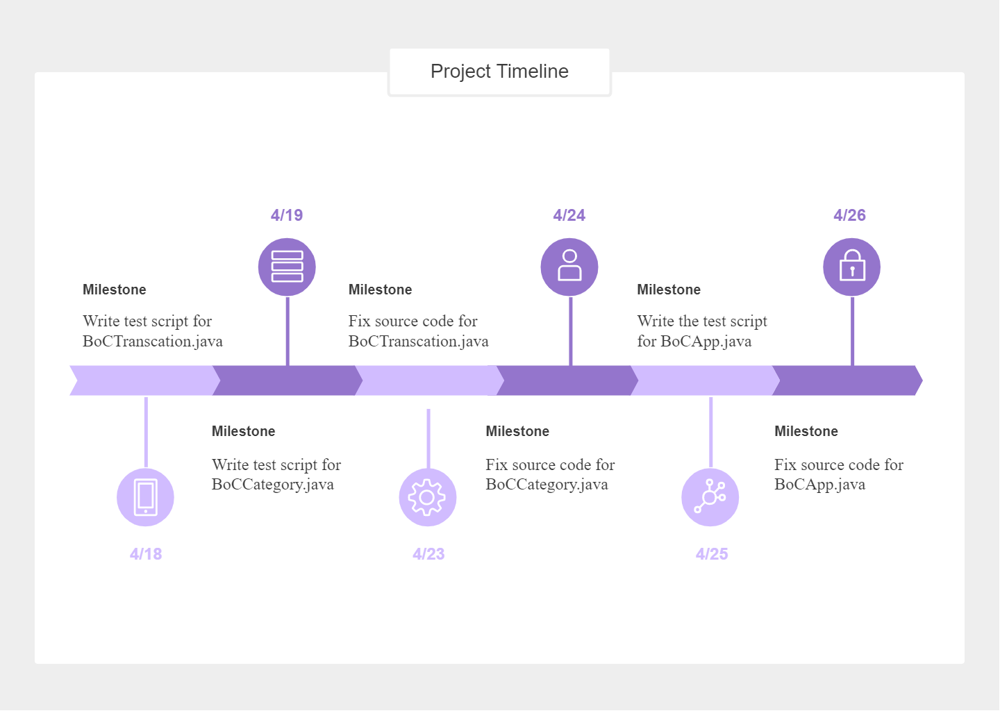

file:///c%3A/Users/VIOLETTE/Desktop/TestReport.md {"mtime":1619430890021,"ctime":1619430890021,"size":0,"etag":"36pfjspqe0","orphaned":false}
# Test Report

| Contents                                               |
| :----------------------------------------------------- |
| [Team Management](#team-management)                    |
| [Test Specification](#test-specification)              |
| [Test Plan](#test-plan)                                |
| [Jump to Class: BoCTransaction](#class-boctransaction) |
| [Jump to Class: BoCCategory](#class-boccategory)       |
| [Jump to Class: BoCApp](#class-bocapp)                 |

## Team Management
Report here, by the end of the assignment, how the team has managed the project, e.g.: used version control, organised meetings, divided work, used labels, milestones, issues, etc. etc.

###  1. Team orgnization
#### 1.1. The Test and Develop Team
* Teams for **BoCCategory class**
    * `Team A` 
        * **Lin Chen** (20215609 @biylc2)
        * **Leshan Tan** ()
    * `Team B`
        * **Ziyi Wang** ()
        * **Zixiang Hu** (20215538 @scyzh6)
    * `Team C` 
        * **Yicun Duan** ()
        * **Yingxiao Huo** ()

* Teams for **BoCTransaction / BoCApp class**

    `The reason for doing team change is until April 19th , we are taught QA team. We think it is important so we adjust our strategy`

    * `Team A` 
        * **Lin Chen** (20215609 @biylc2)
        * **Yicun Duan** ()
    * `Team B` 
        * **Ziyi Wang** ()
        * **Leshan Tan** ()
        * **Yingxiao Huo**()

* Tasks:

    1. Follow the guidelines introduced in the lecture to do Test Driven Development. They are:
        * Create a unit test that fails.
        * Write the unit tests that are complied and sufficiently good enough.
        * Write the production codes that pass the unit tests.

    2. Work in paires to test functions and fix bugs.
        * One person checkes / reviews while other person codes.
        * Take turns to write functions and check codes.
        * For both team members,after testing, filling the test report is expected.  

    3. Change pairs for good practice formally spread
      
    4. By the end of the program, they will have to check the program with the QA member again.

#### 1.2. The QA Member

*   **Zixiang Hu** (20215538 @scyzh6)

* Tasks:
  1. Design the team [workflow](#2-workflow-and-discussions) and documentation system to ensure work efficiency and traceability;
  2. Define [standards](#44-standard-quality-check-requirements) and make sure all of the doucumented / changed file meets the requirements
  3. Approve merge requests only if the changes meet the specifications.
  4. Arrange meetings for the error collection and expected improvements after each stage is finished
  5. Encourage to comment and in the GitLab.
  6. Make sure everyone has his/her tasks using [Milestones](and remind them to complete it on time.
  7. Help team members with technical issues and introduce useful [methods](junit.md) to solve the problem.
  8. Hold discussions for some difficult problem happened while coding/ testing
  9. Check the test coverage and do the `version control`

### 2. Workflow and Discussions

1. **[Overview]**

    

1. **[Meeting]** All members discuss and design a template documentation of test plan and test log.

1. **[Milestone]** :  ***"Write test script for BoC Transaction Class"***

   **[Duedate]**:  ***"Apr 22, 2021"***
   
    * **[Assignment]** `Team A`: ~Issue Assigned:  #7 make test plan and implement test code for `BoCTransaction` on a separated branch.
    * **[Assignment]** `Team B`: ~Issue Assigned: #6 make test plan and implement test code for `BoCCategory` on a separated branch.
 * **[Assignment]** `Team C`: ~Issue Assigned: #4, #5 make test plan and implement test code for `BoCCategory` on a separated branch.
   
    * **[Problem solving]** ~ Cannot open idea projects using Eclipse. (Finally we decide to configure the same working environment, and run on the same ide: IDEA)
    * **[Discussion]** ~ Discuss how to use git to make our project in order [~ see Git usage].
    * **[Meeting]** ~ Introduce how to use `csvSourceFile` and how to test `Setter` and `Getter` together.
    * **[Discussion]** ~ Discuss what the default constructer actually do and the expected output.
    * **[Discussion]** ~ Discuss how to test `Date` object.
    * **[Discussion]** ~ Discuss how to test the `BigDecimal` type using as it can accept 4 types.
    * **[Discussion]** ~Discuss how to test main constructor in just one method
    * **[OfficeHour]** ~Ask teacher the list of 
    problems we encountered [Question](Question.md)
    * **[Meeting]** How to combine separate methods into one file. 
    * **[+ [Review] +]** Check all the functions are tested and swap to check others' codings. Check the variety use of assert functions.
    * **[+ [Merge] +]** After each issue is solved, we merge that branch of issue into master.

2. **[Milestone]** : ***"Write the test script for BoC Category Class"***
    **[Duedate]**:  ***"Apr 25, 2021"***
    
    * **[Assign & [+ Branch +]]** `Team A`: ~Issue Assigned: #14, #18, #20, #23, #26, #27 make test plan and implement test code for `BoCTransaction` on a separated branch 
    * **[Assign & [+ Branch +]]** `Team B`: ~Issue Assigned: #12, #13, #15, #16, #17, #19, #21, #25 Fix `BoCCategory` following TDD on a separated branch.
    * **[Meeting]** ~Reorganize our team and make Zixiang Hu to be our QA member,reassign the tasks.
    * **[Meeting]** ~What exceptions are expected to thrown for each cases.
    * **[Discussion&&OfficeHour]** ~ How to test a unique Category name of the default constructor of `BoCCategory`.
    * **[Comment]** ~ What is the acceptable parameter for setCategoryBudget function. 
    * **[Comment]** ~ How to test null input from the csv file.
* **[ProblemLeaving]** ~ Cannot use `Arguments.of` @MethodSource
    * **[+ [Review] +]** ~Completeness of our function test
* **[Discussion]** ~Two ways of testing addExpense function,which one is more logical.
    * **[Meeting]** Error collections/Improvements and uncompleted tasks. Swap to review others' coding and inspect various method for testing.
    * **[+ [Merge] +]** After each issue is solved, we merge that branch of issue into master.
    
3. **[Milestone]**:  ***"Fix script for BoC Transaction Class"***

    **[Duedate]**:  ***"Apr 27, 2021"***

    * **[Assign & [+ Branch +]]** `Team A`: ~Issue Assigned: #44, #45, #48 Each team member fix corresponding part of `BoCCategory` following TDD on a separated branch.
    * **[Assign & [+ Branch +]]** `Team B`: ~Issue Assigned: #21, #28, #37, #46, #47 Each team member fix corresponding part of `BoCCategory` following TDD on a separated branch.
    * **[Discussion]** ~When to fix bugs: before the app test or after the app test
    * **[Meeting]** ~ How to create unique default constructor.
    * **[Comment]** ~When to fix setCategoryBudget as it will influence BoCApp. 
    * **[Meeting]** ~Refactoring code together
    * **[+ [Review] +]** ~ Completeness of our function test
    * **[Comment]** ~Change for the return type of isComplete function .
    * **[Discussion]** ~ Discuss the format of the test log.
    * **[+ [Merge] +]** The report with test log and refactored function.
    * **[Meeting]** ~ Change the format of the test function and test log.
    * **[+[Review]+]** ~ Swap to check team members' function and give some suggestions

4. **[Milestone]**:  ***"Fix script for BoC Category Class"***
    **[Duedate]**:  ***"Apr 27, 2021"***
    
    * **[Assign]** ~ Done
    * **[Meeting]** ~ Introduce a static function and global varibles used for all the tests in the BoCAppTest class. 
    * **[Discussion]** ~Discuss about other methods for testing the I/O
    * **[Meeting]** ~ Discuss all the possible situations that may happen in the AppTest.
* **[+ [Coverage Test] +]** ~ Check the test code coverage using `run with Coverage` in the IDEA.
    
1. **[Milestone]**:  ***"Write the test script for BoCApp Main Class"***
    
    * **[Assign]**:  ***"Apr 27, 2021"***
    * **[Meeting]** Refactor main method together.

### 3. `GitLab` Usage
1. Issues
    * Issues are used for fixing specific bugs,we have an issue for each function test. If the function requires code modification, a new issue is created for fixing this bug.
    * Each issue have a corresponding branch with a specific branch name created by Git. However, branch in early stage is deleted, as at that time we thought leave all the branches there is messy.
    * When developers encounter a problem,they may comment below their issues. If others can solve the problem, they will give their answers under the comment. It helps the coodination between team members.
    * `Assignee` ,` Due date` --- who will solve the problem and by when. QA member will check the due date and remind the team member if the task is overdue.
    * `Labels`, `Milestone` --- for which subproject and the type of issue.
    * **[+ Create merge request and branch +]** : After an issue is fixed, it should be merged into the master branch after being checked.

2. Labels
    * ~"" Lists to-do items as reminders.
    * ~Doing Ongoing events - should be finished before the due date.
    * ~Done Archives finished tasks.
    * ~Discussion Record meetings and discuss problems one encounters with the whole team.
    * ~Tips Share methodologies, tools, experiences with the whole team.
    * ~Bugs Report bugs find for later analysis.
3. Issue Boards
    * An overview of all the tasks and progress.
4. Commit messages
    * Commit messages mainly tells what the modification has been done on which test.
5. Milestones
    * Are used to assign a subproject,which consists of lots of issues. And it can be used to track the the completeness of subprocess, the participations of team members.
6. Merge Requests
    * Are expected to have `pictures` of what modifications have been done to the file and its output(for test). `[newly improved for readability]`
    * All merge request should be approved by Zixiang Hu after checking the correctness.

7. Tags
    * Tags will be used for version control.

### 4. Quality Assurance
#### 4.1 Pair programming
  * One person thinks/checkes while other person codes. And the pair changes.
#### 4.2 Code Review
  * The QA member will mainly focus on this problem and associate with the team member directly whether by discussion or using comment.
  * Have a meeting about error collections after each stage
#### 4.3 Regression Testing 
  * Regression Testing are required each time the code is modifies to ensure that other functions can process correctly.

#### 4.4 `[Standard quality check requirements]`
  * Use table to check whether meet the requirements after fixing.

#### 4.5 Independent QA Team
  * Regularly check submitted code and provide suggestions accordingly.
  * Ensure the style consistency among the whole project.
### 5. Traceability
#### 5.1 Cross-Reference
  * Unique IDs are assign to each test plan and test log

    **Format**:
    * `TS`-test type,`AS`-attempt type
    * Function name
    * The number of the subtest according to the requirements and its test case number.

* Theses IDs are referenced among:
    * `Test Plan` and `Test Log` documentation, where these IDs are defined;
    * `JUnit` test code using `@DisplayName` before each test;
    * `[Bug reports]`

#### 5.2 History
  * Code modifications:
    * `When`: In the function, it used last modified time, but in the `Test Log`, all the test times are expected.
    * `Why`: Why change this code.
    * `Who`: The tester or modifier.
    * `How`: Written in the `Test Log` or in the merge request pics.

### 6. Standards
 #### 6.1 Programming standards
 * Software: IntelliJ IDEA 
 * Environment: Java version 15.0.2 
 * Coding conventions:
   * `Naming variables`: Camel case / related to its purpose
   * `Naming file names`: Underscore case
   * `Naming functions`: relate to the method's functionality
   * Have method header format
   * Add `comments`
   * depth of conditional nesting cannot be more than 10 lines
   * length of code are expected to be in 50 lines
   * No duplicate code in the same class or other class
   * Declare global variables only if necessary to use in the other methods
   * Double check creation of static variables inside a class;
    * Avoid accessing variables directly from other classes instead use getter and setter methods

 #### 6.2 Standard quality check requirements
1. Control the visibility of information in a program 
1. Check all inputs for validity 
1. Provide a handler for all exceptions
1. Minimize the use of error-prone constructs 
1. Provide restart capabilities 
1. Check array bounds 
1. Include timeouts when calling external components 
1. Name all constants that represent real-world values

### Methods
[Docs for using methods](junit.md)

## Test Specification

### Test importance marking system

| Importance Level |   Importance   | Description                                                  | Example                                                      |
| :--------------: | :------------: | ------------------------------------------------------------ | ------------------------------------------------------------ |
|        1         |   **`Low`**    | whether the program provides smooth **user experience**      | Spelling errors in prompt messages.                          |
|        2         | **`Moderate`** | whther the program properly handles **rare exceptional usage** | A transaction value of 3E9.                                  |
|        3         |  **`Major`**   | whether the program properly handles **common exceptional usage** | A negative transaction value.                                |
|        4         | **`Critical`** | whether the program processes **normal usage** as expected   | A normal transaction record.                                 |
|        5         |  **`Fatal`**   | whether the program properly handles exceptions which may **mess up user data** | When user edits a transaction, another transaction is actually modified. |

`Note that "mess up user data" is of highest importance because this is a FINANCIAL app where wrong data is severer than program crash.`

### Test Coverage

| Line Coverage | Function Coverage | Condition Coverage |Path Coverage |
|----|--|---|-- |
|BoCCategory| | | |
|BoCTransaction| | | |
|BoCApp| | | |

## Test Plan and Test Log

### Class: `BoCTransaction`